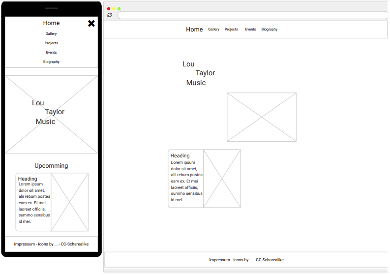
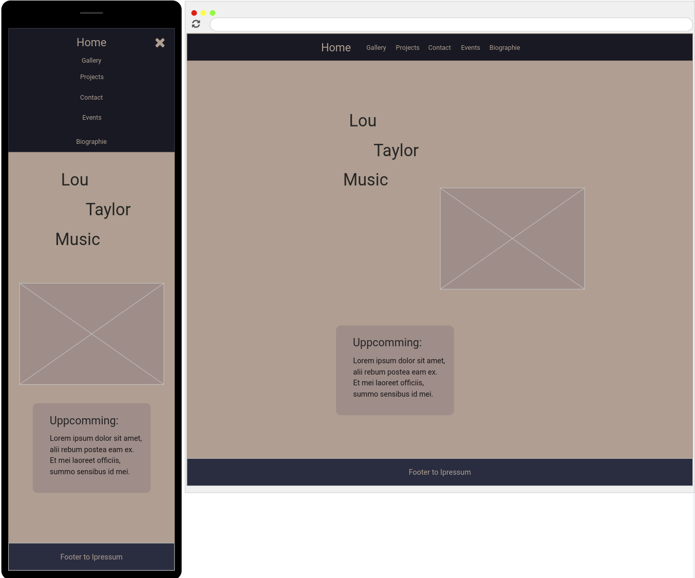

# Lou Taylor Music

## About

This is a website for Lou Taylor a Jazz Sing and Songwriter based in the canton of Bern.

## Design

### Color

For the colors, I use [Bastille-8](https://lospec.com/palette-list/bastille-8) as a color palette.
The creamy colors are meant to emphasize the rather old history of jazz and create a calm environment.

### Font

The font is the sans font of the client. In this way, the user has a familiar element and can hold on to something familiar.
The sans serif font is intended to reflect the elegance of jazz.

### Layout

Here is a screenshot of the first Wireframe made for this site.



In color it looks like this:



These are rather old and due too accessibility concerns (the colors aren't very high in contrast) and because
the contents of the website weren't yet known at the time the layout shifted a bit over the time.


## Features

### "Demnächst"-section 
For ease of use, the upcoming section on the Homepage is loaded through a markdown file so
that they can be changed easily while in production.
The file is located at */etc/upcoming.md*.

### Gallery

The images displayed in the gallery are also configured inside the *etc* (editable text configurations) directory.
Inside the file *gallery.json* path and alt text can be specified.

``` json
[
  {
    "src": "/assets/caffewalz.jpeg",
    "alt": "Songcover zu meiner Single “Café Waltz“"
  }
]
```

## Developing


```bash
npm run dev
```

## Building

To create a production version of your app:

```bash
npm run build
```

The outputs in the build directory are ready to be put on to a static server.
